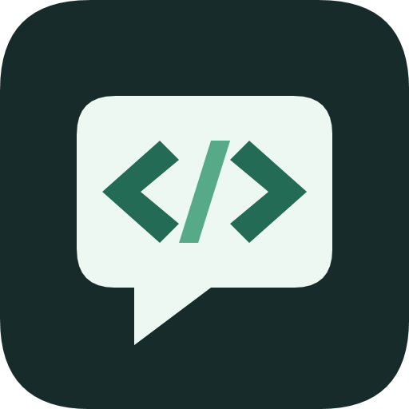
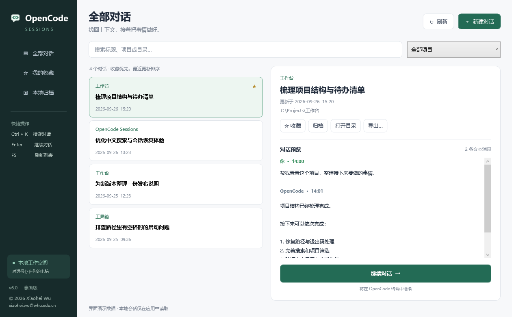

<p align="center">
  
</p>

<h1 align="center">OpenCode Sessions</h1>

<p align="center">简洁的 Windows OpenCode 对话管理器 · 找回上下文，继续工作</p>

<p align="center">
  <a href="LICENSE"></a>
  
  
</p>

**用图形界面管理会话，在 OpenCode 终端里继续对话。** 搜索、按项目筛选、收藏、归档、预览和导出都在一个原生桌面窗口中完成。

[English](README.en.md) · [使用说明](app/README.md) · [构建与发布](docs/DEVELOPMENT.md) · [上传 GitHub](docs/PUBLISHING.md) · [更新记录](CHANGELOG.md)



> 上图由 WPF 离屏渲染生成，使用合成演示数据，不包含真实会话。本工具是独立项目，与 OpenCode 官方没有隶属关系。

## 功能

- **快速找到对话**：多关键词搜索标题、项目、目录和会话 ID，按项目筛选。
- **整理工作上下文**：收藏优先排序；本地归档可随时恢复，不删除原始会话。
- **预览历史消息**：显示用户和助手文本、附件名称，保留中文显示。
- **继续或新建**：在对应项目目录打开 OpenCode 终端；目录搬迁后可手动重新定位。
- **导出记录**：Markdown 文本或完整 OpenCode JSON。
- **轻量运行**：无需浏览器、常驻服务或 fzf；GUI 使用 Windows WPF。

## 环境要求

| 项目 | 要求 |
| --- | --- |
| 系统 | Windows 10 / 11 |
| 运行时 | .NET Framework 4.8 |
| OpenCode | 预先安装 CLI；已验证 1.18.32 的会话列表与导出格式 |
| fzf | GUI 不需要；旧 CLI 选择器可选使用 |

管理器不随包分发或自动下载 OpenCode，也不会自动发送模型请求。OpenCode 安装见[官方文档](https://opencode.ai/docs/)。

## 快速开始

**使用发布包**：在本仓库的 Releases 中下载 `OpenCodeSessions-v6.0.0-windows.zip`，完整解压后双击 `OpenCodeSessions.exe`。如尚无 Release，可从源码构建，或下载本仓库 Actions 的构建产物。

**添加桌面快捷方式**：运行解压目录里的 `Install.cmd`，无需管理员权限。安装后可在终端输入 `ocr.cmd`。旧终端选择器保留为 `ocr-cli.cmd`。

**从源码运行**：在仓库根目录执行：

```powershell
powershell.exe -NoProfile -ExecutionPolicy Bypass -File .\scripts\Build.ps1
.\app\OpenCodeSessions.exe
```

快捷键：`Ctrl+K` 搜索、`F5` 刷新、会话列表中 `Enter` 继续。搜索框内 `Esc` 清空关键词。

## 数据与边界

- 通过 OpenCode 的 `session list` / `export` 命令读取本机当前用户的数据，不直接改写 OpenCode 数据库。
- 收藏、归档和目录映射保存在 `%LOCALAPPDATA%\OpenCodeSessionManager\settings.json`。
- 安装目录为 `%LOCALAPPDATA%\OpenCodeSessionLauncher`；卸载保留原始会话和收藏设置。
- 预览最多显示最近 60 条文本消息，每条最多 6000 字符；完整 JSON 导出保留全部记录。
- 暂不汇总 WSL、Docker 或远程机器上的会话，不在 GUI 内发送消息。
- 未对可执行程序做代码签名；发行包内提供 SHA-256 文件校验。

## 开发与验证

```powershell
# 不要求安装 OpenCode，不访问真实会话
powershell.exe -NoProfile -ExecutionPolicy Bypass -File .\scripts\Test.ps1

# 可选：只读验证本机 OpenCode 数据
powershell.exe -NoProfile -ExecutionPolicy Bypass -File .\scripts\Test.ps1 -Live

# 构建、测试并生成 ZIP 和校验文件
powershell.exe -NoProfile -ExecutionPolicy Bypass -File .\scripts\Package.ps1
```

仓库包含 Windows GitHub Actions 工作流，会执行构建、离线测试和打包，并上传构建产物；云端不读取用户会话。首次推送后的实际运行结果以 Actions 页面为准。

## 仓库结构

```text
app/                 WPF 程序、图标和安装/卸载脚本
tests/               后端、离屏渲染与隔离安装测试
scripts/             仓库级构建、测试、发布打包入口
docs/                开发、上传说明与合成界面预览
.github/             CI、Issue/PR 模板和依赖更新配置
LICENSE              MIT 许可证
```

源码仓库不提交 EXE、ZIP、用户设置和会话导出。可执行发布包由构建生成，放到 GitHub Releases。

## 参与贡献

欢迎提交 Issue 和 Pull Request。请先阅读 [CONTRIBUTING.md](CONTRIBUTING.md)。安全问题请参阅 [SECURITY.md](SECURITY.md)。

## 许可证与作者

[MIT License](LICENSE) · Copyright © 2026 **Xiaohei Wu**  
联系邮箱：**xiaohei.wu@whu.edu.cn**
